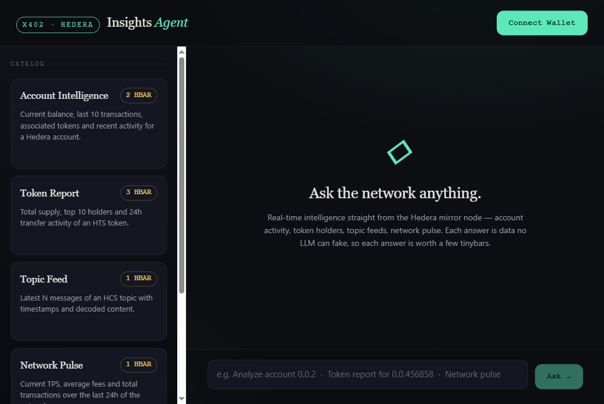

# Hedera Insights Agent

A **commerce agent** on Hedera that sells real-time on-chain intelligence, paid
**per request in HBAR via x402**. Humans query it through a conversational chat
UI; other AI agents buy from it through ACP endpoints. Every answer comes
straight from the Hedera mirror node — data no LLM can fabricate, which is what
makes each micropayment worth paying.

> Bounty Week 4 submission · Built with **Hedera Agent Kit JS (v4)** · x402 · ACP



---

## Live demo

- **App (chat UI):** `<RAILWAY_WEB_URL>` — _fill in after deploy_
- **Agent API (catalog):** `<RAILWAY_AGENT_URL>/catalog`

> Hosted on Railway. A keep-alive health check (`/health`) is pinged every 14
> days to satisfy the 90-day availability requirement.

---

## What it does

Ask in natural language — _"Analyze account 0.0.2"_, _"Token report for
0.0.456858"_, _"Network pulse"_ — and the agent:

1. resolves your request to one of five priced services,
2. asks for payment (HTTP **402 Payment Required**, x402),
3. takes the HBAR micropayment — your **HashPack** wallet signs and submits the
   transfer on-chain, and the agent verifies it on the mirror node,
4. fulfills the query from the live **mirror node**, and
5. returns the data with a **"Verified on Hedera"** badge linking to HashScan.

Other agents skip the UI and use the ACP endpoints directly.

---

## Stack

| Layer | Tech |
|---|---|
| Frontend | Next.js 14 (App Router), zero-dependency custom design system |
| Backend / Agent | Node.js + Express (TypeScript, ESM) |
| AI runtime | **Hedera Agent Kit JS v4** (`@hashgraph/hedera-agent-kit` + LangChain v1) |
| Payment gate | **x402** (HTTP 402 + `X-PAYMENT`) → HashPack direct settlement, verified on the mirror node |
| Wallet | **HashPack** via WalletConnect v2 (`@hashgraph/hedera-wallet-connect`) |
| Commerce protocol | **ACP** — `/catalog`, `/checkout_session`, `/orders/:id` |
| Data source | Hedera **Mirror Node** REST API (testnet) |
| Blockchain | Hedera Testnet |

---

## Architecture

```
                    ┌───────────────────────── Buyers ─────────────────────────┐
                    │                                                           │
          Human (chat UI)                                       AI buyer-agent (ACP)
                    │                                                           │
                    ▼                                                           ▼
        POST /resolve (free)                                        GET /catalog (free)
        → service + price                                           POST /checkout_session
                    │                                               → x402 payment_handler
                    ▼                                                           │
        ┌───────────────────────────  POST /insights  ◄─────────────────────────┘
        │                              (x402-GATED)
        │   no X-PAYMENT ─────────────► 402 Payment Required + PaymentRequirements
        │                                      │ HashPack signs+submits HBAR transfer
        │   X-PAYMENT (txId) ─────────► verifyPayment() ──► Hedera Mirror Node (verify tx)
        │                                      │ (dev mode: local, no settlement)
        │                                      ▼ valid
        │                              runService() ──► Hedera Mirror Node REST
        │                                      │
        │                                      ├─► fulfill ACP session (Map)
        │                                      └─► optional LLM summary (Agent Kit)
        ▼
   result + tx_proof (HashScan)  ──►  GET /orders/:id  → status: fulfilled
```

---

## Services & pricing

| service_id | Name | Returns | Price |
|---|---|---|---|
| `account-intelligence` | Account Intelligence | Balance, last 10 txs, associated tokens | 2 HBAR |
| `token-report` | Token Report | Supply, metadata, top 10 holders | 3 HBAR |
| `topic-feed` | Topic Feed | Latest N HCS messages, decoded | 1 HBAR |
| `network-pulse` | Network Pulse | Live TPS estimate, avg fee, HBAR supply | 1 HBAR |
| `wallet-forensics` | Wallet Forensics | Frequent counterparties + volume | 5 HBAR |

All values are fetched live; none are fabricated. Where the network does not
expose a metric (e.g. exact 24h token transfers), the service reports what the
mirror node actually returns rather than inventing a number.

---

## How to use (chat)

1. Open the app and click **Connect Wallet** (paste a testnet account id, or use
   the demo account).
2. Type a question, e.g. `Analyze account 0.0.2`.
3. The agent returns a **402** → a payment modal shows the price in HBAR.
4. Confirm → the query is fulfilled and the result appears with a HashScan link.

---

## Buy from another AI agent (MCP)

The agent-to-agent path ships as an **MCP server** (`packages/mcp`) so any
MCP-capable agent — **Claude Code, Claude Desktop, OpenCode**, … — can discover,
pay for and consume the same services with no UI and no human. The server signs
and submits the HBAR transfer headlessly with a configured wallet; the calling
agent just asks _"buy account intelligence for 0.0.2"_.

```bash
npx -y hedera-insights-mcp config   # prints ready-to-paste Claude & OpenCode configs
```

Same binary, two client schemas (both from official docs). See
[`packages/mcp/README.md`](./packages/mcp/README.md) for the full setup.

---

## Run it locally

Requirements: Node ≥ 20, pnpm ≥ 10.

```bash
pnpm install

# Backend
cp packages/agent/env.example packages/agent/.env     # works as-is in dev mode
# Frontend
cp packages/web/env.example packages/web/.env.local

pnpm dev        # runs agent (:3001) and web (:3000) together
```

Open <http://localhost:3000>. The default `X402_MODE=dev` lets the full
pay→fulfill loop run with **no testnet credentials and no real settlement**, so
a clean checkout works immediately.

### Quick API check (no UI)

```bash
curl localhost:3001/catalog
curl -X POST localhost:3001/insights -H 'content-type: application/json' \
  -d '{"service_id":"network-pulse","params":{}}'          # → 402
PAY=$(printf '{"x402Version":1,"scheme":"exact","network":"hedera:testnet","payload":{}}' | base64 -w0)
curl -X POST localhost:3001/insights -H 'content-type: application/json' \
  -H "X-PAYMENT: $PAY" -d '{"service_id":"network-pulse","params":{}}'   # → live data
```

---

## Going live (real payments)

Live mode uses **direct settlement**: the buyer's HashPack wallet signs and
submits the HBAR transfer on-chain, and the agent verifies it on the public
mirror node (success + treasury credited with the required amount). No
facilitator and no treasury private key are needed to verify a payment.

1. **Backend** — set in `packages/agent/.env`:
   - `HEDERA_ACCOUNT_ID` = treasury account that should receive the HBAR (the
     x402 `payTo`). A private key is **not** required for verification.
   - `X402_MODE=live`.
   - (Optional) `DEEPSEEK_API_KEY` for natural-language summaries. Without it the
     agent runs deterministically and the paid data path still works.
2. **Frontend** — set `NEXT_PUBLIC_WALLETCONNECT_PROJECT_ID`
   ([cloud.walletconnect.com](https://cloud.walletconnect.com)) to enable real
   HashPack pairing instead of the demo connector. The buyer needs a funded
   testnet account in HashPack.

Flow: 402 → frontend reads `payTo` + amount → HashPack `TransferTransaction`
(buyer → treasury) signed & executed → tx id sent in `X-PAYMENT` → backend polls
the mirror node, validates, and fulfills. The HashScan badge links the real tx.

---

## Deploy (Railway)

- **Backend:** root `packages/agent`, build `pnpm build`, start `node dist/server.js`.
- **Frontend:** root `packages/web`, build `pnpm build`, start `pnpm start`;
  set `NEXT_PUBLIC_AGENT_URL` to the backend URL.
- Add a cron (every 14 days) hitting `<AGENT_URL>/health` so the free tier never
  sleeps — covers the 90-day requirement.

---

## Known limitations (hackathon honesty)

These are intentional, documented shortcuts — search the code for `HACK:`.

- **x402 dev mode** (`X402_MODE=dev`) accepts a well-formed payment payload
  without on-chain settlement, so the demo runs anywhere. `live` mode does real
  direct settlement (HashPack submits the transfer, agent verifies on the mirror
  node).
- **Payment replay**: live mode verifies a tx id against the mirror node but does
  not yet persist consumed ids, so a payment could in theory be replayed for
  multiple queries. A 5-minute freshness window limits this; production would
  store spent ids (Redis/SQLite).
- **Demo wallet connector** asks for a testnet account id instead of a real
  WalletConnect session. Real HashPack pairing is gated behind
  `NEXT_PUBLIC_WALLETCONNECT_PROJECT_ID`.
- **ACP sessions** live in an in-memory `Map` (no DB) — fine for the MVP, lost on
  restart.
- **24h token transfers** are not a single mirror-node call; Token Report ships
  supply + top holders rather than an invented transfer count.

## Post-hackathon

- Persist consumed payment tx ids to prevent replay (Redis/SQLite).
- Persist ACP sessions (Redis/SQLite).
- AP2 credential validation on the buyer header; MPP multi-query sessions.
- SSE streaming of agent responses.

---

## Feedback

AI Studio tooling feedback for the bounty: `<link to the GitHub issue you open
in a Hedera AI Studio repo>` — _add before submission._
